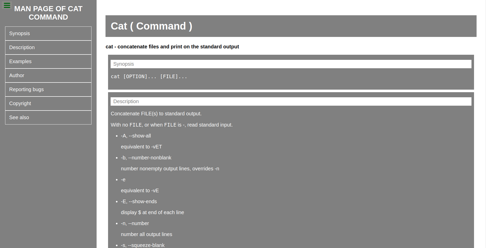

# FCC-Technical_page

> Technical page is created for the CAT command (Linux/Unix).

FreeCodeCamp suggested a project to create a technical page and here we go for CAT command mainly used on Linux and Unix systems to show content of a file.

## Built With

- HTML & CSS
- None
- VS Code and linters

## Live Demo

[Live Demo Link](https://raovikrant82.github.io/FCC-Technical_page/)

## Authors

👤 **Author**

- GitHub: [@raovikrant82](https://github.com/raovikrant82)
- Twitter: [@Imvikrantrao](https://twitter.com/Imvikrantrao)

## 🤝 Contributing

Contributions, issues, and feature requests are welcome!

Feel free to check the [issues page](../../issues/).

## Show your support

Give a ⭐️ if you like this project!

## 📝 License

This project is [MIT](./MIT.md) licensed.
